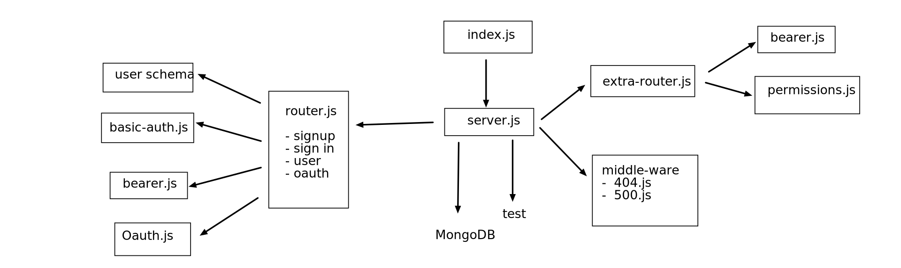

# authentication

## auth-server
Author: Sondos Matahen

## Setup
   * .env requirment
   * PORT - 4000
   * URL=mongodb://localhost:27017/authr
   * KEY=mytoken

## How to initialize/run your application
using postman or swagger

* get all users : GET - http://localhost:4000/users
* signup : POST - http://localhost:4000/signup
  - body = {username : 'some name' , password : 'pass'}
* signin : POST - http://localhost:4000/signup
  - Authoraization --> enter the username and the paeeword

## UML 
  